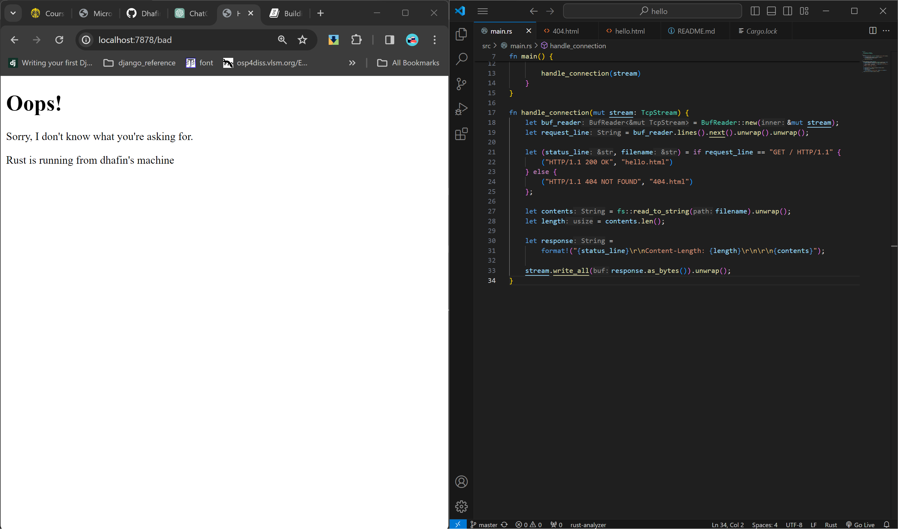

# Tutorial 6 Notes

## Commit 1 Reflection
Kode yang telah ditulis dan di commit adalah sebagian kecil dari web server app. Penjelasan dari bagian-bagian kode yang telah ditulis adalah sebagai berikut:

<hr>

```rust
use std::{
    io::{prelude::*, BufReader},
    net::{TcpListener, TcpStream},
};
```
Merupakan bagian kode yang melakukan import untuk I/O, buffered reader, TCPListener untuk mendengarkan TCP connections dan TCP stream yang mewakili koneksi antara local dan remote socket

<hr>

```rust
fn main() {
    let listener = TcpListener::bind("127.0.0.1:7878").unwrap();

    for stream in listener.incoming() {
        let stream = stream.unwrap();

        handle_connection(stream)
    }
}
```
Merupakan main function yang menghubungkan TCPT listener dengan localhost di port 7878 dan unwrap digunakan untuk handle case error atau panic. Kemudian masuk infinite loop yang mendengarkan TCP connections terus. Untuk tiap connectino yang valid, program memanggil handle_connection.

<hr>

```rust
fn handle_connection(mut stream: TcpStream) {
    let buf_reader = BufReader::new(&mut stream);
    let http_request: Vec<_> = buf_reader 
        .lines() 
        .map(|result| result.unwrap())
        .take_while(|line| !line.is_empty()) 
        .collect();

    println!("Request: {:#?}", http_request);
}
```
Fungsi ini mengambil referensi dari TCPStream dan kemudian membungkus stream dengan BufReader untuk membuat pembacaan baris lebih efisien. Kemudian stream tadi akan diubah menjadi vektor berisi string yang berisi http request dan kemudian di print dengan rapih.

## Commit 2 Reflection


Pada commit ke-2 terdapat import baru yaitu
```rust
use std::fs;
```
yang merupakan standard library dari rust file system module untuk read write file.

<hr>

Kemudian terdapat beberapa tambahan pada handle connection function:
```rust
// code

let status_line = "HTTP/1.1 200 OK"; 
let contents = fs::read_to_string("hello.html").unwrap(); 
let length = contents.len();

let response =
    format!("{status_line}\r\nContent-Length: {length}\r\n\r\n{contents}");

stream.write_all(response.as_bytes()).unwrap();
```
- status)line mendefinisikan status dari http response 
- contents mengisi content dari http response dengan hello.html dalam bentuk string. 
- length merepresentasikan ukuran dari body response
- response menggabungkan bagian bagian tadi menjadi satu http response lengkap sebagai string.
- write_all mencoba menulis message lengkap ke dalam strream memastikan HTTP response telah dikirim dan dalam bentuk bytes karena ditulis response.as_bytes()


## Commit 3 Reflection
Kali ini kode diubah sedemikian rupa sehingga bila kita mengakses url yang belum di define oleh main function, maka program akan mengeluarkan html page seperti berikut:



dan pada commit kali ini function handle_connection diubah lagi sebagai berikut:

```rust
let request_line = buf_reader.lines().next().unwrap().unwrap();
```

untuk mendapatkan request method dan target url

<hr>

```rust
let (status_line, filename) = if request_line == "GET / HTTP/1.1" {
    ("HTTP/1.1 200 OK", "hello.html")
} else {
    ("HTTP/1.1 404 NOT FOUND", "404.html")
};
```
untuk menetukan status dan filename apa yang akan digunakan sebagai response html

<hr>

```rust
let contents = fs::read_to_string(filename).unwrap();
let length = contents.len();

let response =
    format!("{status_line}\r\nContent-Length: {length}\r\n\r\n{contents}");
```
untuk membuat response lengkap berdasarkan isi dari variable yang telah ditentukan sesuai dengan request yang dibuat